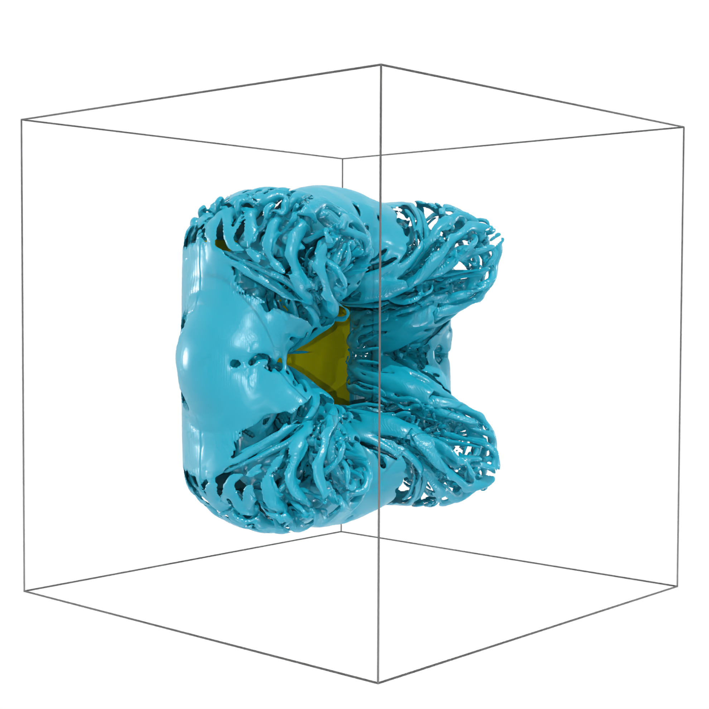

# BiotSavartBCs

[](https://github.com/WaterLily-jl/BiotSavartBCs.jl/actions/workflows/CI.yml?query=branch%3Amain)
[](https://codecov.io/gh/WaterLily-jl/BiotSavartBCs.jl)



This repository defines an extension to the [WaterLily.jl](https://github.com/WaterLily-jl/WaterLily.jl) flow solver, adding "external flow" boundary conditions based on the [Biot-Savart equation](https://en.wikipedia.org/wiki/Biot%E2%80%93Savart_law#Aerodynamics_applications). This equation is used to update the velocity *on the boundaries* of the simulation domain based on the vorticity *within* the domain. The resulting boundary conditions are an excellent model for external flow, allowing you to use very small domains around any immersed bodies. [See the paper for the detailed methodology and validation.](https://arxiv.org/abs/2404.09034)

### WaterLily.jl Simulations with BiotSavartBCs.jl

Install the package from the Julia package manager
```julia
julia> ]
pkg> add BiotSavartBCs
```
Using these new boundary conditions within a `WaterLily` simulation is really straightforward; this requires changing only two (😱) lines of code. The first one is obviously

```julia
using WaterLily,BiotSavartBCs
```
The second line that you have to modify creates the Biot-Savart Simulation structure
```julia
sim = BiotSimulation((4L,2L,2L), Ut, L; body=AutoBody(sdf,map), ν=U*L/Re, T, mem=CUDA.CuArray)
```
You can update and plot the simulation structure exactly the same as with a standard WaterLily `Simulation`
```julia
sim_step!(sim, t_end; remeasure::Bool)
```
There are numerous examples in the `examples` folder of this repository that show how to use these new boundary conditions in practice.

### Method

This package takes a practical approach to avoid the two fundamental issues with applying the Biot-Savart equation to set the boundary conditions of a projection-based Navier-Stokes solver: 
 1. A naive weighted sum over the $N_s$ vorticity sources at every cell for all $N_t$ targets at the domain cell faces would make the boundary condition update take $O(N_s N_t)$ operations, making it *orders of magnitude slower* than the rest of the solver. We accelerate the BC update by clustering the vorticity sources using a tree method (oct-tree in 3D and quad-tree in 2D). This reuses the pooling method in WaterLily's Multigrid pressure solver and reduces the cost to $O(\log(N_s) N_t)$. We can further accelerate the BC update by also clustering the target faces - making this an $O(N_t)$ Fast Multi*level* Method FMℓM - a variant of the classic [Fast Multipole Method](https://en.wikipedia.org/wiki/Fast_multipole_method). Finally, we parallelize over all the targets using [KernelAbstractions.jl](https://github.com/JuliaGPU/KernelAbstractions.jl) which works on the GPU or multi-threaded CPU.
 2. The pressure projection step depends sensitively on the boundary conditions, but these *cannot be set* since the unknown pressure generates vorticity on immersed bodies. We solve this problem using a matrix partition method, similar to the approach used for partitioned Fluid-Structure-Interaction (FSI) methods. In practice we see the Multigrid pressure solver actually converges *faster* with `BiotSavartBCs` than with reflection BCs.

The resulting simulation update is very fast, especially with large 3D grids on the GPU - exactly where the ability to use a snug domain is the most important. See the paper for detailed methods, examples, and computational benchmarks. 

### Mixed domain boundary conditions

You can turn off the Biot-Savart update on a domain face by passing its index to the `nonbiotfaces` keyword (-3 is the negative z face, 2 is the positive y face, etc.). The normal velocity on that face then stays zero, giving a slip wall:
```julia
sim = BiotSimulation((2N,N,N),(U,0,0),L;ν=U*2L/Re,body,nonbiotfaces=(-2,-3))
```
To make that face a symmetry plane instead, the Biot-Savart boundaries also need the influence of the image vorticity, which you add by overwriting the `symmetry` function. See [`examples/square_sym.jl`](examples/square_sym.jl) for both cases.

#### Periodic boundary conditions

A 3D simulation can be periodic in one direction, such as the span of a cylinder, by passing `perdir`:
```julia
sim = BiotSimulation((4D,2D,D),(1,0,0),D;body,ν=D/Re,perdir=(3,))
```
The Biot-Savart boundaries account for the periodic images of the vorticity automatically.

### Gallery

Here are a few renderings of the cool things you can do with [`WaterLily.jl`](https://github.com/WaterLily-jl/WaterLily.jl) and these new Biot-Savart BCs

#### Flow behind a square plate at Re=125,000
[](https://www.youtube.com/shorts/CNQqI5rRdug)

[](https://www.youtube.com/shorts/tbf06uhnAEQ)

#### Flow behind a Doritos at Re=25,000
[](https://www.youtube.com/shorts/spFlx2YW0pg)

## Reproducing the results

The scripts used to produce the results presented [here](https://arxiv.org/abs/2404.09034) are in the `examples` folder, which has its own `Project.toml` environment (Julia `v1.11` or later). Clone the repository and instantiate that environment
```bash
git clone https://github.com/WaterLily-jl/BiotSavartBCs.jl
cd BiotSavartBCs.jl
julia --project=examples -e "using Pkg; Pkg.instantiate()"
```
and then run any of the example scripts within it, e.g.
```bash
julia --project=examples examples/ImpulsiveCircle.jl
```
The examples are set up for an NVIDIA GPU (`mem=CUDA.CuArray`); use `mem=Array` to run them (slowly) on the CPU.

The plots in the paper are written directly to `tex/fig` by these scripts:

| Script | Paper figures |
|---|---|
| `ImpulsiveCircle.jl` | `ImpCircle_Cd.png`, `ImpCircle_4_vort.png` |
| `DiskTests.jl` | `Disk_force_comparison.png`, `Disk_force_comparison_methods.png` |
| `Sphere.jl` | `drag.png` (and prints the mean drag values quoted in the text) |
| `AirfoilWake.jl` | `CL_mean_deflected_wake.png`, `poincare_deflected_wake.png` |
| `LambDipoleTests.jl` | `lamb_dipole_error_dists.png`, `lamb_dipole_speedup.png` |
| `HillVortexTests.jl` | `Hill_error_dists.png`, `Hill_speedup_dists.png` |

### Citing

We simply ask you to cite the references below in any publication in which you have made use of the `BiotSavartBCs` project. If you are using other `WaterLily` packages, please cite them as indicated in their repositories.

```bibtex
@article{weymouth2024biot,
    title={Using Biot-Savart boundary conditions for unbounded external flow on Eulerian meshes},
    author={Gabriel D. Weymouth and Marin Lauber},
    year={2024},
    eprint={2404.09034},
    archivePrefix={arXiv},
    primaryClass={physics.flu-dyn}
}
```
